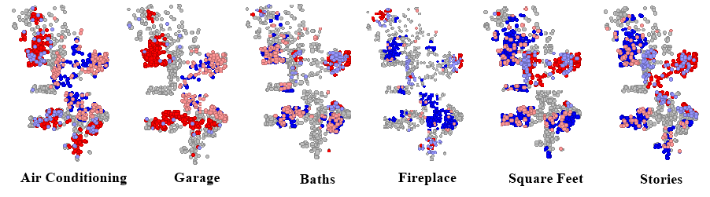
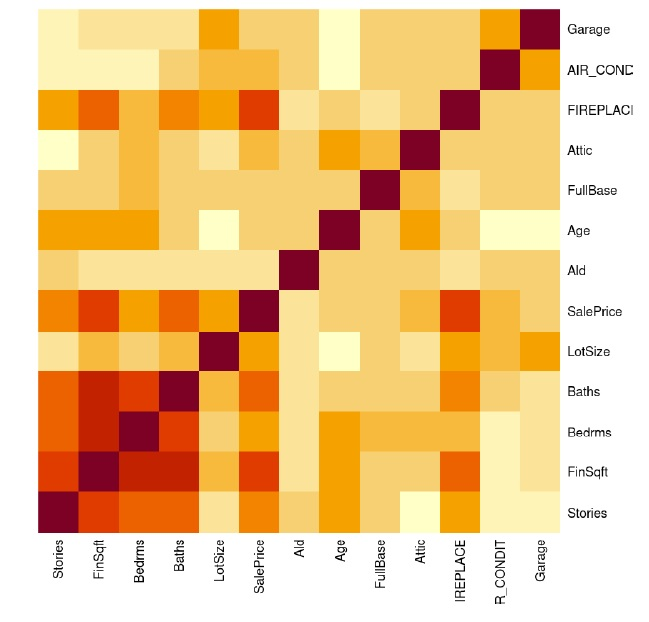
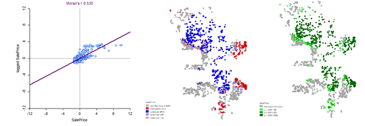
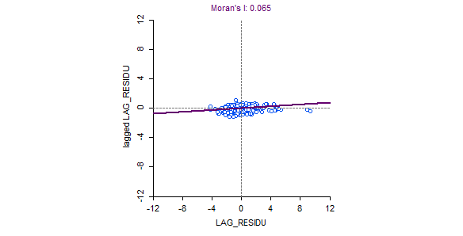
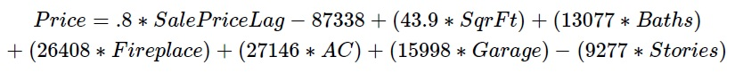

# Spatial Regression Analysis of Home Prices in Milwaukee, Wisconsin (2012)

**Author:** Dustin Littlefield  
**Portfolio:** https://github.com/dustinlit  
**Project Type:** `Spatial Statistics` `Regression Modeling` `Exploratory Spatial Data Analysis`  
**Technologies:** `ArcGIS Pro` `OLS` `Spatial Lag Model` `Spatial Weights Matrix`  
**Last Updated:** 2023

## Overview

This project analyzes **determinants of home prices in Milwaukee, Wisconsin (2012)** using spatial statistical methods. The workflow includes exploratory spatial data analysis, construction of a spatial weights matrix, Ordinary Least Squares (OLS) regression, and a **Spatial Lag Model** to account for spatial autocorrelation in housing values.

The analysis demonstrates how spatial dependence influences real‑estate pricing and highlights the importance of incorporating spatial structure into regression modeling.

  

---

## Data Exploration

Initial exploratory analysis examined the distribution of home prices and key housing attributes.  
The uploaded document includes figures showing variable distributions and spatial patterns.  
Example excerpt:  
> “Air Conditioning — Garage — Maths — Fireplace”

These variables were evaluated for spatial clustering and suitability for regression modeling.

  

---

## Spatial Weight Matrix

A spatial weights matrix was constructed to quantify neighborhood relationships between housing units.  
The PDF includes a labeled figure:  
> “Variable Spatial Analysis”

This matrix forms the basis for spatial diagnostics and the Spatial Lag Model.

---

## Ordinary Least Squares (OLS) Analysis

An OLS model was estimated using home price as the dependent variable and structural attributes (e.g., air conditioning, garage, fireplace) as predictors.

The PDF includes a full OLS output table (blanked in the provided copy), indicating coefficient estimates, significance levels, and model fit statistics.

Key steps included:

- Evaluating multicollinearity  
- Inspecting residuals for spatial autocorrelation  
- Comparing predicted vs. observed home values  

Because the OLS residuals exhibited spatial dependence, a spatial regression model was required.

  

---

## Spatial Lag Model

A Spatial Lag Model was estimated to account for the influence of neighboring home prices on each observation.

The document includes a spatial‑lag coefficient table and diagnostic figures.

This model improves on OLS by incorporating a spatial autoregressive term:

- Captures spillover effects in housing markets  
- Reduces spatial autocorrelation in residuals  
- Provides more reliable coefficient estimates  

  

---

## Equation Analysis

The final section of the report interprets the regression equations and the role of each predictor in explaining home price variation.  
Although the PDF contains placeholders for equations, the structure indicates:

- A standard OLS linear model  

  

---

## Summary

This project demonstrates competency in:

- Spatial statistical modeling  
- Building and interpreting spatial weights matrices  
- Running OLS and Spatial Lag regressions  
- Diagnosing spatial autocorrelation  
- Applying spatial econometrics to real‑world housing data  

It serves as an example of integrating **spatial analysis + regression modeling** to understand urban housing markets.

