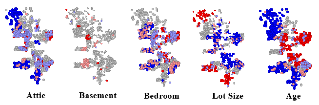

# Spatial Regression Analysis of Home Prices in Milwaukee, Wisconsin 2012
**Author:** Dustin Littlefield
**Date:** 10/11/2024
**Class:** GIS 471 Fall Session A 2024
**Instructor:**  Dr. Andrew Trgovac

## Data Exploration

I begin the regression analysis of the Milwaukee Home Sales in 2012 by performing basic data cleaning and examination. Because it is not in numerical format and since it is unlikely to influence the sales price because all sales occured in the same year, the **SaleDate** field was dropped from the dataset. The X and Y coordinates are dropped as well, they will be utilized in the spatial analysis of the data using Geoda.

A quick scan of the data indicates that there are no empty values in the dataset.

``` python

library("IRdisplay")
library("foreign")

Home <- read.dbf("Milwaukee_Sales_2012_Data.dbf", as.is = F)
df <- subset(Home, select = -c(SaleDate,X,Y))
paste("Total NA values: ", sum(is.na(Home)))
```

A correlation heatmap generated from the refined dataset provides valuable insights into which variables may have the greatest influence on sales price before performing spatial analysis.
``` python
cordf = cor(df)
heatmap(cordf, Colv=NA, Rowv=NA, scale='none')
```
Apparent significant variables according to the heatmap include:

* Square footage
* Number of baths
* Number of bedrooms
* Lot size
* Air conditioning
* Fireplace


## Spatial Weight Matrix

Given the nature of the data, I rule out a contiguity-based weight because the data is composed strictly of point data and utilizing boundaries does not make sense in this case. Instead, I opt for an inverse distance-based matrix. An inverse distance approach is more aligned with the natural pattern of home prices, as more distant higher-priced homes can still exert some influence, although diminishing with increasing distance.
``
paste("Range of X values: ", round(max(Home[,"X"]) - min(Home[,"X"])))
paste("Range of Y values: ", round(max(Home[,"Y"]) - min(Home[,"Y"])))
``
Looking at the range of the raw X and Y data causes me to suspect that a **threshold distance** of _5000_ may be appropriate. A higher threshold may create an inflated number of neighbors and experiments with higher thresholds did indeed exhibit lower Moran's I indexes. K nearest neighbors was considered but ruled out due to a low Moran's index and because it does not account for the decay of influence of home prices over distance.


<div style="text-align: left;">

## Variable Spatial Analysis

### Dependent Variable


<div style="text-align: left;">

For the first step of the spatial analysis, I conducted a **Local Moran's I** analysis on the dependent variable, **SalePrice**. Understanding the overall spatial pattern of this variable will guide the selection of independent variables and the appropriate regression method to use. 

The global **Moran's I** score of _0.53_ indicates significant positive spatial autocorrelation, meaning that home prices are spatially clustered rather than randomly distributed. The resulting cluster map shows that low-value homes are clustered with other low value homes in the central and northern parts of the city, while higher-priced homes are clustered together in the downtown eastern region and the southern outskirts.

To further validate these findings, I performed a **Getis G*** analysis, which confirms the results of the Moran’s analysis. The eastern and southern regions exhibit clusters of high prices, while the north and central areas show clusters of low prices, reinforcing the spatial patterns identified.


<div style="text-align: left;">


### Independent Variables

For each independent variable present, I created a **Local Moran's I** cluster map. The aim is to compare the spatial relation of each variable to the spatial pattern of the dependent variable and utilize this knowledge to pick variables to include in the regression equation.

#### Rejected Variables


<div style="text-align: left;">


To minimize spatial correlation in the error term, the following variables were rejected due to weak or no discernible spatial correlation with home prices, they also generated negligible Moran's index values:
* **Attic** - No clear spatial relationship with the sales price is present.
* **Basement** - No clear spatial relationship is apparent.
* **Bedrooms** - Has minimal spatial correlation with home prices. Despite it being borderline, my decision was to exclude it. It remains a potential candidate to be included during later analysis.
* **Lot size** - The pattern reveals that lot size is more clearly related to a home's location in the city and not the sale price. Also, the lot size of a property in a city is a more complicated variable. A large lot in the city center will be much more valuable than an equal sized lot located in the outskirts.
* **Age** - Like lot size, the age of a home is more directly correlated with its location in the city rather than with home prices.

#### Accepted Variables


<div style="text-align: left;">


The variables selected for the regression analysis are shown above. Since these variables exhibit some degree of correlation with the spatial cluster patterns observed in the **SalePrice** distribution, they were included in the regression analysis. 
* **Square footage**, **Baths**, **Air Conditioning** and **Fireplace** -  These variables may have the strongest influence as they also ranked highly on the correlation heat map analysis.
* **Garage**, **Stories** - These are the weaker correlating values and candidates for reconsideration.

## Ordinary Least Squares Analysis


<div style="text-align: left;">

The initial run of the ordinary least squares method using the inverse distance based spatial weight matrix and the variables chosen for regression analysis generated An $R^2$ score of _.54_ indicating moderate predictive ability. The $F-statistic$ value of _282_ indicates that the independent variables do a respectable job explaining the spread of the dependent variable. Of note, the **Garage** field is the only field with a questionable $p-score$ of _.057_ and is a candidate for further investigation for deeper analysis techniques to clarify this variable's influence.

The **Lagrange Multipliers** for both lag and error are significant, as is the **SARMA**, indicating that a **Spatial Durbin Model** may be appropriate in this circumstance. A Moran's I analysis of the residuals show significant spatial dependence still remeains in the error term. Being limited by Geoda's capabilities and given the spillover nature of home prices, I choose to follow up with a spatial lag model instead of the spatial error model.


<div style="text-align: left;">


## Spatial Lag Model


<div style="text-align: left;">


<div style="text-align: left;">
  
The Spatial Lag Model indicates a marginally increased **log likelihood** score and slightly decreased **AIC** and **Schwarz criteria** indicating a moderately better fit than the ordinary least squares model. Performing a Moran's index on the residuals shows significant improvement with almost no spatial autocorrelation. The **likelihood ratio test** value of _1025.5576_ supports the idea that this model is a better fit.

## Equation Analysis

$$Price = .8 * SalePriceLag - 87338 + (43.9 * SqrFt) + (13077 * Baths) + 
(26408 * Fireplace) + (27146 * AC) + (15998 * Garage) - (9277 * Stories)$$
In the final equation, the constant is problematic as it indicates a negative base price if all other factors are zero. This may be compensating for the sales price lag variable and the fact that a zero term for variables like square footage do not make a lot of sense. Due to the use of the spatial lag model, the coefficients cannot be directly correlated to their values. However, I **speculate** to the level of influence that each variable's coefficient may possess. They breakdown as follows:

* **SalesPriceLag** - High influence. A lag coefficient of 0.8 indicates a heavy spatial influence from the values of surrounding homes.
* **Square Footage** - Unknown influence. This is interesting because this variable had the highest influence according to the correlation heat map.
* **Bath** - Positive influence. This is an expected result because it is common to see more expensive houses with a larger number of bathrooms.
* **Fireplace** - Positive influence. Fireplaces may be a luxury indicator in the city. 
* **AC** - Positive influence. Like fireplaces, AC may be a luxury good in the city.
* **Garage** - Positive influence. Garage space may be important in Wisconsin to protect cars from the elements.
* **Stories** - Negative influence. Houses with multiple stories may on average be older and require more maintenance.

In conclusion, the regression equation produced by the spatial lag model is a decent approximate predictor of home prices in Milwaukee, Wisconsin in 2012. While experimentation with variable inclusion, normalization, and deeper statistical analysis of the variables may have positive effects on the regression, additional data and/or a more complex combination of spatial lag and spatial error methods may be necessary for significant improvement.
